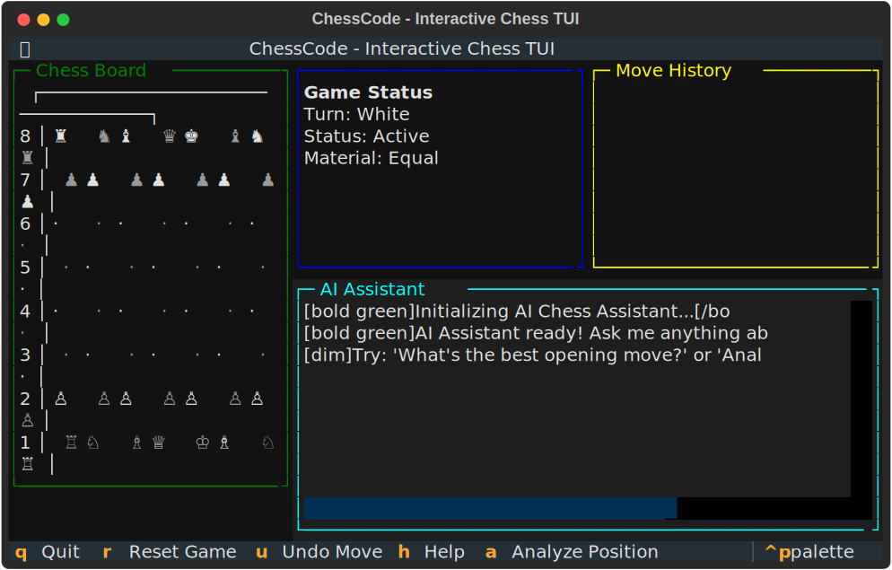

> **Note:** This project has been completely migrated from a Streamlit web app to a modern Textual TUI application. See the [Changelog](CHANGELOG.md) for full details.

# ChessCode - Interactive Chess TUI

An interactive terminal-based chess application built with **Textual**, featuring an AI assistant powered by **LangGraph** and **Grok-4** for intelligent analysis and free-form question answering.



## Features

- **Interactive Terminal UI**: A fully interactive chessboard experience in your terminal, built with the Textual framework.
- **AI-Powered Analysis**: Get strategic insights and move suggestions from an AI assistant powered by Grok-4 and LangGraph.
- **Free-Form Questions**: Ask any question about the current position, chess strategy, or openings in natural language.
- **Real-Time Game State**: Keep track of whose turn it is, game status (check, checkmate), and material advantage.
- **Move History**: View a complete history of all moves made in the current game.
- **Keyboard Shortcuts**: Use convenient shortcuts for common actions like resetting the game, undoing moves, and getting help.

## Installation

1.  **Clone the repository:**
    ```bash
    git clone https://github.com/kaljuvee/chesscode.git
    cd chesscode
    ```

2.  **Install dependencies:**
    ```bash
    pip install -r requirements.txt
    ```

3.  **Set up your environment variables:**
    Create a `.env` file by copying the `.env.sample` template and add your XAI API key:
    ```bash
    cp .env.sample .env
    # Now edit .env and add your key
    ```
    Your `.env` file should look like this:
    ```env
    # LLM Provider Configuration
    MODEL_PROVIDER=xai
    MODEL=grok-4-fast-reasoning

    # API Keys
    XAI_API_KEY=your-xai-api-key-here
    ```

## Usage

Run the Textual TUI application:

```bash
python3 chess_tui.py
```

-   **Make moves** by typing standard chess notation (e.g., `e4`, `Nf3`, `O-O`) and pressing Enter.
-   **Ask questions** in natural language (e.g., `analyze this position`, `what is the best move?`).

## Project Structure

```
chesscode/
├── agents/               # Core LangGraph agent and LLM provider
│   ├── chess_agent.py
│   └── llm_provider.py
├── docs/                 # Documentation and screenshots
│   ├── 01_initial_state.svg
│   └── SCREENSHOTS.md
├── tests/                # Test suite for UI and agent
│   └── test_ui.py
├── chess_tui.py          # Main Textual TUI application
├── requirements.txt      # Python dependencies
├── .env.sample           # Environment configuration template
├── README.md             # This file
└── CHANGELOG.md          # Project version history
```

## Architecture

The application's intelligence is powered by a `ChessAgent` built with **LangGraph**. This agent processes user queries, analyzes the current board state, and uses the **Grok-4** model from **xAI** to generate insightful and educational responses.

The user interface is built with **Textual**, a modern TUI framework for Python, providing a responsive and interactive experience directly in the terminal.

## Contributing

1.  Fork the repository
2.  Create a feature branch (`git checkout -b feature/your-feature`)
3.  Commit your changes (`git commit -am 'Add some feature'`)
4.  Push to the branch (`git push origin feature/your-feature`)
5.  Create a new Pull Request

## License

This project is licensed under the MIT License. See the [LICENSE](LICENSE) file for details.
